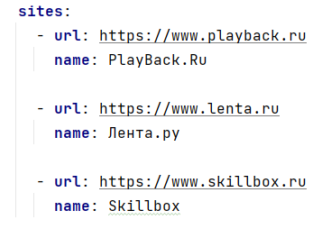
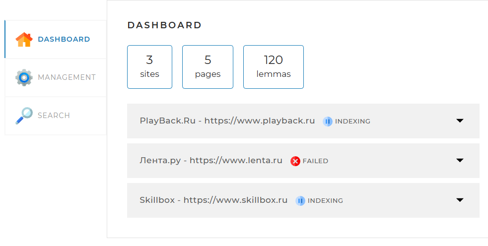
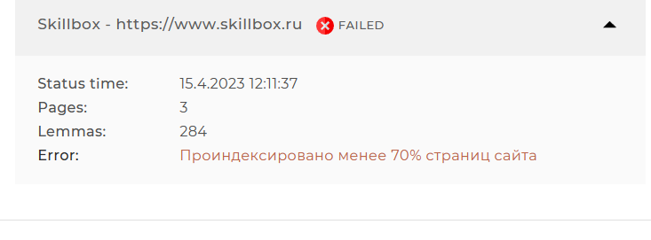
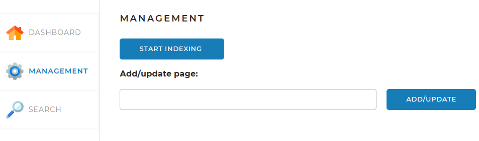
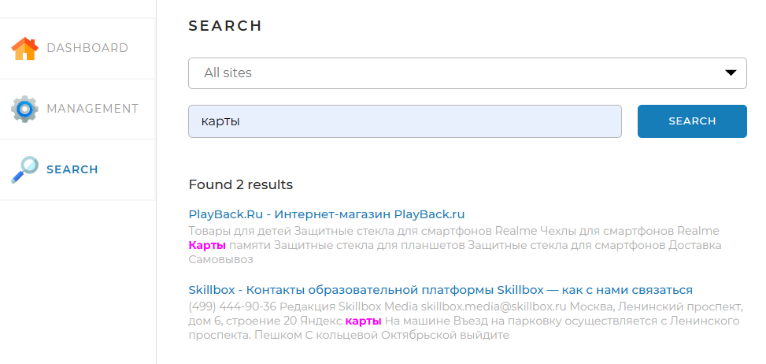

# SearchEngine

<div align="center">
    
    <br>
</div>
Дорогие друзья!
Вашему вниманию предлагается SearchEnglne - веб-приложение, созданное на базе фреймворка Spring. С его помощью вы сможете осуществлять быстрый и удобный поиск, как в рамках нескольких, определённых вами сайтов, так и по каждому из них в отдельности. В проекте список этих сайтов с их именами задаётся в файле конфигурации:

<div align="center">
    
    <br>
</div>
Стартовая страница приложения (Dashboard) предоставляет нам информацию об общем количестве сайтов, по которым будет происходить поиск, количестве проанализированных (проиндексированных) страниц этих сайтов и о всех, обнаруженных на этих страницах уникальных леммах (исходных значениях слов).

<div align="center">
    
    <br>
</div>

В бек-энде за формирование этой страницы отвечает класс StatisticService.
Выпадающие списки предложат вам сведения по каждому сайту в отдельности:
<div align="center">
    
    <br>
</div>

На вкладке Management находятся инструменты управления поисковым движком - запуск и остановка полной индексации (переиндексации), а также возможность добавить (обновить) отдельную страницу по ссылке:
<div align="center">
    
    <br>
</div>

В проекте реализация этих задач происходит в классах IndexingService, IndexingPage и WebSearchTask.
На странице Search находится поле поиска и выпадающий список с выбором сайта для поиска. При нажатии 
на кнопку 'Найти' выводятся результаты: ссылки на сайты, в которых обнаружены запрошенные слова,
и фрагменты текста (сниппеты), в которых выделены эти слова:
<div align="center">
    
    <br>
</div>

Основная поисковая работа происходит в проекте в классе IndexingSearch.
За создание сниппетов и лемматизацию отвечают классы MakeSnippet и LemmaFinder.

## Запуск проекта

Взаимодействие Java с фреймворком Spring, как и использование библиотеки Jsoup, обеспечивается зависимостями в Maven.
Для сборки понадобятся:
- **JDK 19**
- **Maven 3**

Перед сборкой следует отредактировать файл настроек `application.yml`

### Настройка приложения
#### Подключение к порту
```yaml
server:
  port: 8080
  ```
#### Подключение к БД
Настройки подключения к базе данных задаются следующим образом:
```yaml
  datasource:
    url: jdbc:mysql://localhost:3306/search_engine?useSSL=false&requireSSL=false&allowPublicKeyRetrieval=true
    username: root
    password: (your password)
    
В настройках Hibernate  строка`ddl-auto` отвечает за пересоздание таблиц при перезапуске программы.
Возможные варианты:
- `none` не предпринимать никаких действий
- `create` создать новые таблицы при запуске, старые данные удаляются
- `create-drop` создать новые таблицы при запуске, при завершении приложения удалить их
- `validate` проверить соответствие таблиц описанным в программе сущностям
- `update` при наличии расхождений в состоянии БД и в описании сущностей в программе, обновить таблицы в БД

Для обычной работы рекомендуется использовать флаги `none` или `update`, как альтернативный вариант, можно вообще не использовать этот тег.

Желаем успешной и удобной работы с программой SearchEnglne!